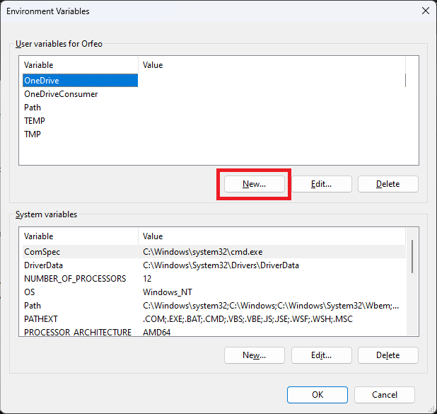
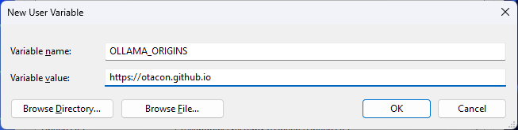

<!-- TOC -->
* [Setup CORS](#setup-cors)
  * [What is CORS](#what-is-cors)
  * [Settings Environment Variables for CORS in Ollama](#settings-environment-variables-for-cors-in-ollama)
    * [MacOS](#macos)
    * [Linux](#linux)
    * [Windows](#windows)
<!-- TOC -->

# Setup CORS

## What is CORS
Cross-Origin Resource Sharing (CORS) is a security feature that allows or restricts web applications 
running at one domain to request resources from another domain. For developers working with OLLAMA, 
an innovative tool designed to streamline and enhance various programming tasks, understanding and 
managing CORS settings is crucial for seamless application development and deployment.

## Settings Environment Variables for CORS in Ollama
Configuring CORS in Ollama involves setting environment variables that dictate how resources should 
be shared across domains. The process varies slightly depending on the operating system you’re using 
to run Ollama. Here’s how you can do it:

### MacOS
On MacOS, if you’re running Ollama as an application, setting environment variables involves using 
`launchctl`. This approach allows you to define which origins are allowed to access your resources. 

To allow Olpaka to access your Ollama local instance run:
```bash
launchctl setenv OLLAMA_ORIGINS "https://otacon.github.io"
```

After setting the desired environment variables, restart the Ollama application to apply the 
changes.

### Linux

For Linux users running OLLAMA as a systemd service, the systemctl command is used to set environment variables:
- Use `systemctl edit ollama.service` to open the service file in an editor.
- In the `[Service]` section, add the Environment line with your CORS settings. 

To allow Olpaka to access your Ollama service run:
```
[Service]
Environment="OLLAMA_ORIGINS=https://otacon.github.io"
```

Save your changes, then reload systemd and restart Ollama with:

```bash
systemctl daemon-reload
systemctl restart ollama
```

### Windows
On Windows, Ollama uses the environment variables set for the user or the system:

Ensure Ollama is not running by quitting the application from the taskbar.


Open the Control Panel and navigate to "Edit system environment variables.".

Alternatively search for "environment variables" in the Windows search bar and select
"Edit system environment variables".


Select "Environment variables..."



Choose to edit or create a new variable.


Set the "variable name" to `OLLAMA_ORIGINS`.
Set the "variable value" to `https://otacon.github.io`

Apply the changes and close the control panel. 

Now you can run again Ollama. If it's already running, please restart it to pick up the environment
variables.
